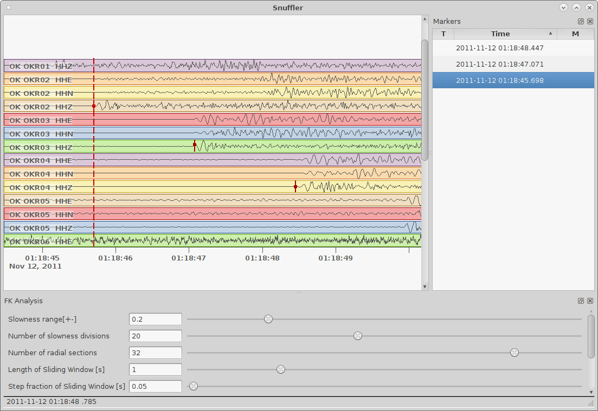
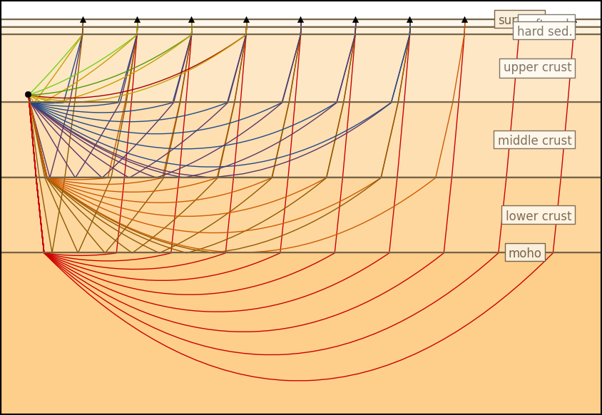
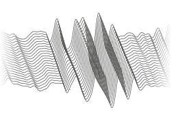
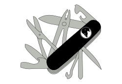
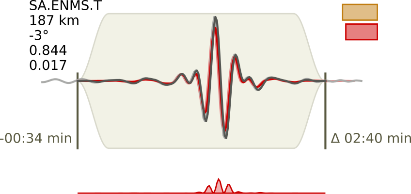
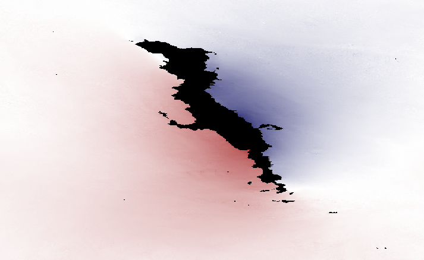
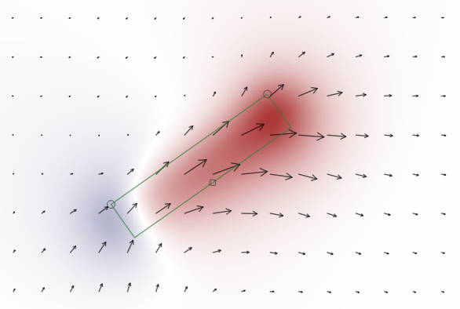

.. image:: http://pyrocko.org/v0.3/_images/pyrocko_shadow.png
    :align: left

*************************************
pyrocko.org - Software for Seismology
*************************************

Pyrocko is an open source seismology toolbox and library, written in the Python
programming language.  It can be utilized flexibly for a variety of geophysical
tasks, like seismological data processing and analysis, modelling of InSAR, GPS
data and dynamic waveforms, or for seismic source characterization.

Development and support is coordinated at https://github.com/pyrocko.

.. raw:: html
    
   

       
       
       
       
       
   

Pyrocko framework
=================

At its core, Pyrocko is a library and framework providing building blocks for
researchers and students wishing to develop their own applications. 

.. raw:: html

    

        <a href="http://pyrocko.org/v0.3" class="icon-button">
            <i class="fa fa-book" aria-hidden="true"></i> 
            Pyrocko manual
        </a>

        <a href="http://pyrocko.org/v0.3/install/" class="icon-button">
            <i class="fa fa-download" aria-hidden="true"></i> 
            Download and installation
        </a>

        <a href="https://github.com/pyrocko/pyrocko" class="icon-button">
            <i class="fa fa-github" aria-hidden="true"></i> 
            Project page on GitHub
        </a>

        <a href="https://github.com/pyrocko/pyrocko/issues" class="icon-button">
            <i class="fa fa-question" aria-hidden="true"></i> 
            Support
        </a>

        <a href="http://pyrocko.org/v0.3/library/examples/" class="icon-button">
            <i class="fa fa-graduation-cap" aria-hidden="true"></i> 
            Code examples
        </a>

    

Applications
============

This section lists some applications built on top of the Pyrocko library. Some
of these may be useful for everyday seismological practice and are `included in
the Pyrocko package <http://pyrocko.org/v0.3/apps/>`_. Some others are tightly integrated with Pyrocko for specialized tasks and can be found in their own software repositories.

Snuffler
--------
.. raw:: html
    
    

        
            <i class="fa fa-tag" aria-hidden="true"></i>
            <a href="http://pyrocko.org/v0.3/apps/snuffler/">Part of Pyrocko</a>
        
    

*Seismogram browser and workbench*

The Snuffler is an interactive and extensible seismogram browser that is suited for small and very big datasets and archives. It features plugins (called `Snufflings
<http://pyrocko.org/v0.3/apps/snuffler/extensions.html>`_), which are helpful
for broad variety of seismological applications. Features include:

* Event and phase picking (manual & STA/LTA)
* Spectral- and FK-analysis
* Beamforming
* Cross-correlation of traces

.. raw:: html
    
    

        
            <i class="fa fa-graduation-cap" aria-hidden="true"></i>
            <a href="http://pyrocko.org/v0.3/apps_snuffler_tutorial.html">Tutorial</a>
        
        
            <i class="fa fa-puzzle-piece" aria-hidden="true"></i>
            <a href="https://github.com/pyrocko/contrib-snufflings">User contributed Snufflings</a>
        
        
            <i class="fa fa-university" aria-hidden="true"></i>
            <a href="http://doi.org/10.5880/GFZ.2.1.2017.001" target="_blank">DOI: 10.5880/GFZ.2.1.2017.001</a>
        
    

Cake
--------
.. raw:: html
    
    

        
            <i class="fa fa-tag" aria-hidden="true"></i>
            <a href="http://pyrocko.org/v0.3/apps/cake/">Part of Pyrocko</a>
        
    

*1D travel-time and ray-path computations*

Cake is a very tasty tool that can be used to solve classical seismic ray theory problems
for layered-earth models (layer cake models). For various seismic phases it can
calculate:

* Arrival times
* Ray paths
* Reflection and transmission coefficients
* Take-off and incidence angles

Computations are done for a spherical earth.

.. raw:: html
    
    

        
            <i class="fa fa-university" aria-hidden="true"></i>
            <a href="http://doi.org/10.5880/GFZ.2.1.2017.001" target="_blank">DOI: 10.5880/GFZ.2.1.2017.001</a>
        
    

Fomosto
--------
.. raw:: html
    
    

        
            <i class="fa fa-tag" aria-hidden="true"></i>
            <a href="http://pyrocko.org/v0.3/apps/fomosto/">Part of Pyrocko</a>
        
    

*Calculate and manage Green's function databases*

Calculation of Green’s functions for synthetic seismograms is a computationally
expensive operation and it can be of advantage to calculate and store them in
advance. Now, for typical application scenarios, the Green’s function traces
can be reused as required. Fomosto offers building of flexible Green's function
databases that can be shared and passed to other researchers, allowing them to
focus on their own application rather then spending days of work to get their
Green’s function setup ready.

.. raw:: html
    
    

        
            <i class="fa fa-database" aria-hidden="true"></i>
            <a href="http://kinherd.org:8080/gfws/static/stores/">Online resource of pre-calculated Green's functions</a>
        
        
            <i class="fa fa-university" aria-hidden="true"></i>
            <a href="http://doi.org/10.5880/GFZ.2.1.2017.001" target="_blank">DOI: 10.5880/GFZ.2.1.2017.001</a>
        
    

Jackseis
--------
.. raw:: html
    
    

        
            <i class="fa fa-tag" aria-hidden="true"></i>
            <a href="http://pyrocko.org/v0.3/apps/jackseis/">Part of Pyrocko</a>
        
    

*Waveform archive data manipulation*

Jackseis is a command-line tool for common manipulations of archived waveform
datasets. Have it in your pocket to do:

* File format conversions
* Dataset conversions between day-files, hour-files, etc.
* Batch replacement of waveform meta-information
* Flexible filename and directory hierarchy manipulations

.. raw:: html
    
    

        
            <i class="fa fa-university" aria-hidden="true"></i>
            <a href="http://doi.org/10.5880/GFZ.2.1.2017.001" target="_blank">DOI: 10.5880/GFZ.2.1.2017.001</a>
        
    

Grond
-----
.. raw:: html
    
    

        
            <i class="fa fa-cube" aria-hidden="true"></i>
            <a href="http://gitext.gfz-potsdam.de/heimann/grond">Download and Documentation</a>
        
    

*Probabilistic source optimization*

Grond is a bootstrap-based probabilistic battering ram to explore and
efficiently converge in solution spaces of earthquake source parameter
estimation problems.

* Trade-off analysis
* Highly flexible objective function design
* Integrated robust waveform data preprocessing
* Visual inspection of many aspects of the optimization problem

.. raw:: html
    
    

        
            <i class="fa fa-university" aria-hidden="true"></i>
            <a href="">DOI: In Preparation</a>
        
    

Kite
----

.. raw:: html
    
    

        
            <i class="fa fa-github" aria-hidden="true"></i>
            <a href="https://github.com/pyrocko/kite">Download and Installation</a>
        
    

*InSAR displacement analysis and postprocessing*

Get your InSAR displacement maps handled the pyrocko way (and prepared for the deformation source analysis in pyrocko). Experience a highly interactive inspection of static displacement fields and data noise. Do easy quadtree data subsampling and data error variance-covariance estimation of InSAR data for proper data weighting in deformation source optimizations.

.. raw:: html
    
    

        
            <i class="fa fa-graduation-cap" aria-hidden="true"></i>
            <a href="https://pyrocko.github.io/kite/">Tutorials and Documentation</a>
        
        
            <i class="fa fa-university" aria-hidden="true"></i>
            <a href="http://doi.org/10.5880/GFZ.2.1.2017.002">DOI: 10.5880/GFZ.2.1.2017.002</a>
        
    

Talpa
-----

.. raw:: html
    
    

        
            <i class="fa fa-tag" aria-hidden="true"></i>
            <a href="https://github.com/pyrocko/kite">Part of Kite</a>
        
    

*Interactive static displacement modelling*

Fault ruptures and volcanic plumbing systems are complex and highly interactive processes which take place in heterogeneous composition of the Earth’s crust. To intuitively study the complexities, we developed a graphical tool to interact and link observed surface displacements with deformation sources. This may guide as a first measure and constrain future finite numerical optimisation. Talpa, the mole, provides interfaces to different displacement codes and models, one beeing ``pyrocko.gf``.

.. raw:: html
    
    

        
            <i class="fa fa-graduation-cap" aria-hidden="true"></i>
            <a href="https://pyrocko.github.io/kite/talpa.html">Examples and Documentation</a>
        
        
            <i class="fa fa-university" aria-hidden="true"></i>
            <a href="http://doi.org/10.5880/GFZ.2.1.2017.002">DOI: 10.5880/GFZ.2.1.2017.002</a>
        
    

.. _publications:

Publications
============

    Heimann, Sebastian; Kriegerowski, Marius; Isken, Marius; Cesca, Simone; Daout, Simon; Grigoli, Francesco; Juretzek, Carina; Megies, Tobias; Nooshiri, Nima; Steinberg, Andreas; Sudhaus, Henriette; Vasyura-Bathke, Hannes; Willey, Timothy; Dahm, Torsten (2017): **Pyrocko - An open-source seismology toolbox and library**. V. 0.3. GFZ Data Services. http://doi.org/10.5880/GFZ.2.1.2017.001

    Heimann, Sebastian; Kriegerowski, Marius; Dahm, Torsten; Simone, Cesca; Wang, Rongjiang: **A Green's function database platform for seismological research and education: applications and examples**. EGU General Assembly 2016, held 17-22 April, 2016 in Vienna Austria, p.15292

    Isken, Marius; Sudhaus, Henriette; Heimann, Sebastian; Steinberg, Andreas; Daout, Simon; Vasyura-Bathke, Hannes (2017): **Kite - Software for Rapid Earthquake Source Optimisation from InSAR Surface Displacement**. V. 0.1. GFZ Data Services. http://doi.org/10.5880/GFZ.2.1.2017.002

.. _material:

Material
========

    Pyrocko Overview Poster - `Download <http://data.pyrocko.org/material/pyrocko-poster-201709.pdf>`_

    Pyrockos' Green's Function Poster - `Download <http://data.pyrocko.org/material/pyrocko-gf-poster-2014.pdf>`_

    Kite Overview and Earthquake Inversion Poster - `Download <http://data.pyrocko.org/material/kite-poster-201709.pdf>`_

.. meta::
    :description: Pyrocko is an open source seismology environment.
    :keywords: Seismology, Earthquake, Geodesy, Earth, Science, Software, Python, software development, open-source, modelling, waveforms, processing, insar, surface deformation
    :audience: scientists, students, researcher, software developer, universities, institutes
    :robots: index, follow
