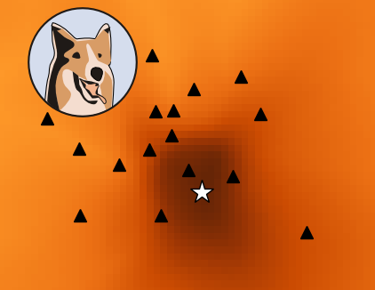

.. image:: http://pyrocko.org/v0.3/_images/pyrocko_shadow.png
    :align: left

****************************************
Pyrocko.org - Geophysical Software Swamp
****************************************

Pyrocko is an open source seismology toolbox and library, written in the Python programming language and developed at the `GFZ Potsdam <http://www.gfz-potsdam.de>`_.
The toolbox architecture is modular and independent, and can be utilized flexibly for a variety of geophysical problems.

Development and support is coordinated at http://github.com/pyrocko.

.. raw:: html
    
   

Pyrocko Framework
=================
Pyrocko is the foundation of wonderful seismological tools prospering in its open-source ecosystem. These tools can be seen as mere frameworks enabling researchers and students rapid development of seismological software and answer questions of seismology.

Tutorials and References
------------------------

* `Download and Installation <http://pyrocko.org/v0.3/install_quick.html>`_
* `Tutorials and Examples <http://pyrocko.org/v0.3/examples.html>`_
* `Documentation <http://pyrocko.org/v0.3>`_

Applications
============
Pyrocko contains applications assisting in everyday seismological practice:

Snuffler
--------
.. raw:: html
    
    

    <i class="fa fa-tag" aria-hidden="true"></i>Part of Pyrocko
    

Seismogram browser and workbench
^^^^^^^^^^^^^^^^^^^^^^^^^^^^^^^^

An extensible seismogram browser suited for big datasets and archives. The Snuffler features plugins (called `snufflings <http://pyrocko.org/v0.3/apps_snuffler_extensions.html>`_) which are helpful for broad variety of seismological applications. The main features are:

* Event and phase picking (manual & STA/LTA)
* Spectral- and FK-analysis
* Beamforming
* Cross correlation of traces

Cake
--------
.. raw:: html
    
    

    <i class="fa fa-tag" aria-hidden="true"></i>Part of Pyrocko
    

1D Travel-time and ray-path computations
^^^^^^^^^^^^^^^^^^^^^^^^^^^^^^^^^^^^^^^^
.. image:: _static/cake_plot_example.png
    :align: left

Cake is a tool which can be used to solve classical seismic ray theory problems for layered earth models (layer cake models). For various seismic phases it can calculate:

* Arrival times
* Ray paths
* Reflection and transmission coefficients
* Take-off and incidence angles

Computations are done for a spherical earth.

Fomosto
--------
.. raw:: html
    
    

    <i class="fa fa-tag" aria-hidden="true"></i>Part of Pyrocko
    

Calculate and manage Green's functions Databases
^^^^^^^^^^^^^^^^^^^^^^^^^^^^^^^^^^^^^^^^^^^^^^^^

.. image:: _static/fomosto_synthetic.png
    :align: left

Calculation of Green’s functions for synthetic models is a computationally expensive operation and it can be of advantage to calculate them in advance. The Green’s function traces can be reused as required in a typical application scenario. Fomosto offers flexible Green's function databases, which can be shared and passed to other researchers, allowing them to focus on their own application rather then spending days of work to get their Green’s function setup ready.

.. raw:: html
    
    <a href="http://kinherd.org:8080/gfws/static/stores/">
        <i class="fa fa-database" aria-hidden="true"></i>Online resource of pre-calculated Green's functions
    </a>

Jackseis
--------
.. raw:: html
    
    

    <i class="fa fa-tag" aria-hidden="true"></i>Part of Pyrocko
    

Waveform archive data manipulation
^^^^^^^^^^^^^^^^^^^^^^^^^^^^^^^^^^

A command-line tool for common waveform archive data manipulation. Conveniently select/resample/trim or rename various seismic data formats.

Grond
-----
.. raw:: html
    
    

    <i class="fa fa-cube" aria-hidden="true"></i>Download and Documentation
    

Earthquake Source Inversion
^^^^^^^^^^^^^^^^^^^^^^^^^^^

.. image:: _static/grond_moment-tensor.png
    :align: left
    :width: 150px

Bootstrap-based probabilistic battering ram to explore solution spaces in earthquake source parameter estimation problems. 

Kite
----
.. raw:: html
    
    

    <i class="fa fa-cube" aria-hidden="true"></i>Download and Documentation
    

Satellite InSAR Displacement Analysis
^^^^^^^^^^^^^^^^^^^^^^^^^^^^^^^^^^^^^

.. image:: _static/spool_screenshot.png
    :align: left

Handling InSAR displacement the pyrocko way. Inspection of static displacement fields, noise analysis and error estimation of satellite InSAR data.

Lassie
-------
.. raw:: html
    
    

    <i class="fa fa-cube" aria-hidden="true"></i>Download and Documentation
    

The friendly Earthquake Detector
^^^^^^^^^^^^^^^^^^^^^^^^^^^^^^^^

Rumble in the Bronx! Lassie is the pal at your side investigating and characterizing local earthquake activitiy.

Additional Resources
====================
* Pyrocko project page on `GitHub <http://github.com/pyrocko>`_
* Snuffler tutorial (with screenshots)
* Repository of user contributed Snufflings (http://www.github.com/pyrocko/contrib-snufflings)
* Webservice: Pre-calculated Green's function stores
* EGU2014 poster: Synthetic seismogram web service and Python tools

Developed at
============
.. image:: _static/gfz_logo.svg
    :align: right

.. meta::
    :description: Pyrocko is an open source seismology environment.
    :keywords: Seismology, Earthquake, Geodesy, Earth, Science, Software, Python, software development, open source,
    :audience: scientists, students, researcher, software developer
    :robots: index, follow
